- **Frontend url**: [Netlify](https://ak-blogs.netlify.app)  <-- click on this link
# AK Blog Project 

A full-stack blogging platform where users can create, read, update, and delete blogs, interact with posts through likes and comments, and explore blogs by categories.  

## 🚀 Features  

- **User Authentication** (Register, Login, Logout with JWT)  
- **Blog Management**  
  - Create, edit, and delete blogs  
  - Upload images/videos to Cloudinary  
- **Engagement**  
  - Like & unlike blogs  
  - Comment on blogs  
- **Explore**  
  - Search blogs by title/content  
  - Filter blogs by category  
- **Profile Management**  
  - Update profile info & password  
  - View other users’ profiles  
- **Admin Controls**  
  - Manage blogs and users  
- **Responsive UI** built with React & Tailwind CSS  

## 🛠 Tech Stack  

**Frontend**  
- React.js  
- Tailwind CSS  
- React Router  
- Axios  

**Backend**  
- Node.js + Express.js  
- MongoDB (Mongoose ODM)  
- JWT Authentication  
- Cloudinary for media uploads  
- Bcrypt for password hashing  

**Other Tools**  
- Git/GitHub for version control  
- Netlify (Frontend Deployment)  
- Render (Backend Deployment)  

## ⚙️ Installation & Setup  

### 1️⃣ Clone the repository  
```bash
git clone https://github.com/Ankit3060/mega-project
cd mega-project
```

### 2️⃣ Backend Setup  
```bash
cd backend
npm install
```

Create a `.env` file in the backend folder:  
```env
PORT = 4000

FRONTEND_URL = your-frontend-url

MONGO_URI = your-mongodb-connection-string

COOKIE_EXPIRE = 7
ACCESS_TOKEN_KEY = your-secret-access-token-key
REFRESH_TOKEN_KEY = your-secret-refresh-token-key
ACCESS_TOKEN_EXPIRY = 15m
REFRESH_TOKEN_EXPIRY = 15d


SMTP_HOST = smtp.gmail.com
SMTP_SERVICE = gmail
SMTP_PORT = 465
SMTP_MAIL = your-email@gmail.com
SMTP_PASSWORD = your-smtp-password


CLOUDINARY_CLIENT_NAME = your-cloudinary-cloud-name
CLOUDINARY_CLIENT_API = your-cloudinary-api-key
CLOUDINARY_CLIENT_SECRET = your-cloudinary-api-secret

```

Start backend:  
```bash
npm run dev
```

### 3️⃣ Frontend Setup  
```bash
cd frontend
npm install
```

Update API URL in `axios` config file (frontend).  

Start frontend:  
```bash
npm run dev
```

### 4️⃣ Visit in Browser  
- Frontend: `http://localhost:5173`  
- Backend: `http://localhost:4000`  

## 📂 Project Structure  

```
ak-blog/
│── backend/         # Express + MongoDB API
│   ├── models/      # Mongoose schemas
│   ├── routes/      # Express routes
│   ├── controllers/ # Business logic
│   ├── middlewares/ # Authentication & error handling
│   └── utils/       # Helper functions (Cloudinary, etc.)
│
│── frontend/        # React app
│   ├── src/components/ # Reusable UI components
│   ├── src/pages/      # Page-level components
│   ├── src/context/    # Auth & search context
│   └── src/assets/     # Images & static files
│
└── README.md
```

## 📸 Screenshots  

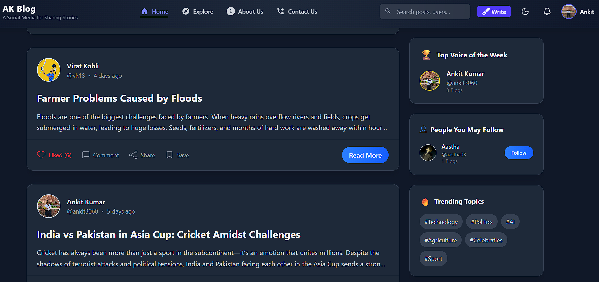
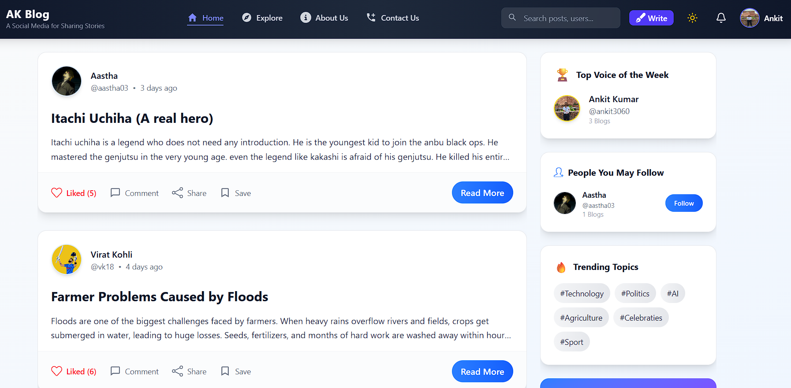
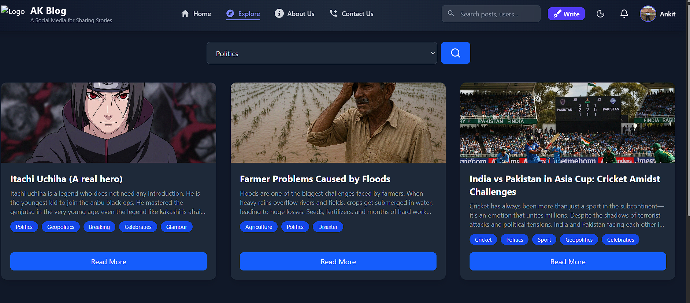
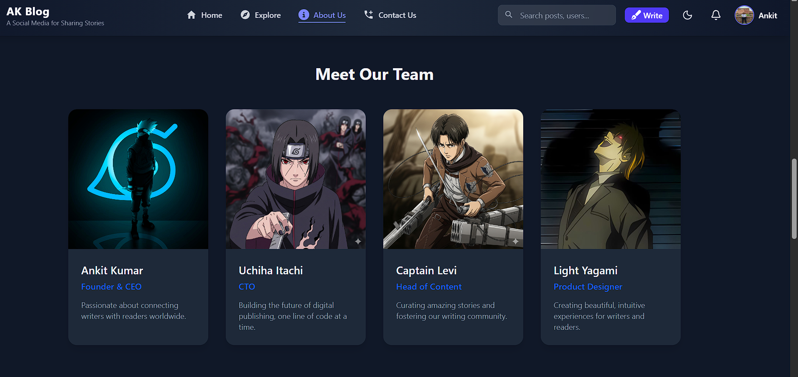

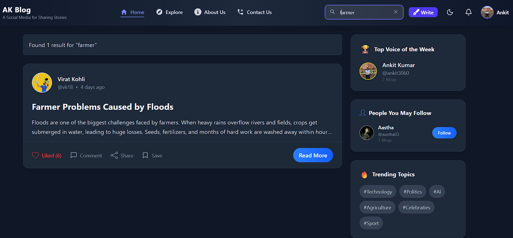
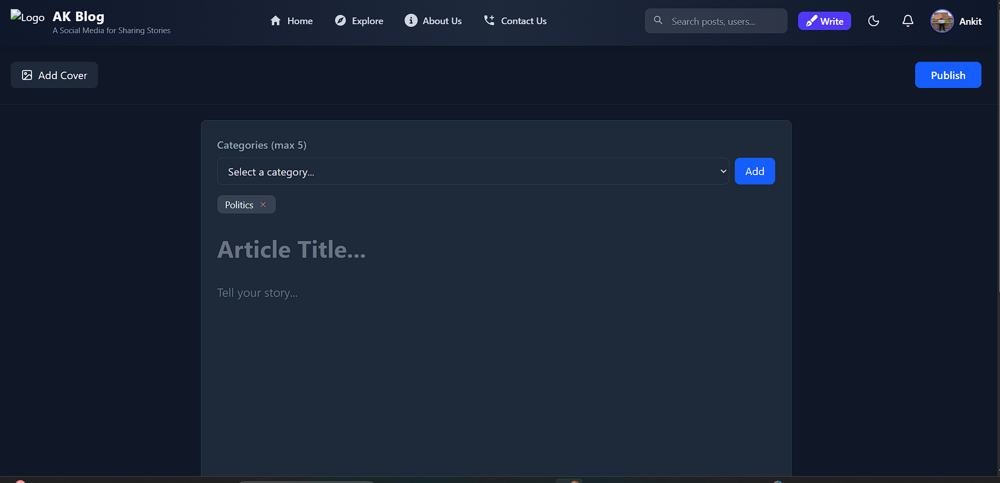
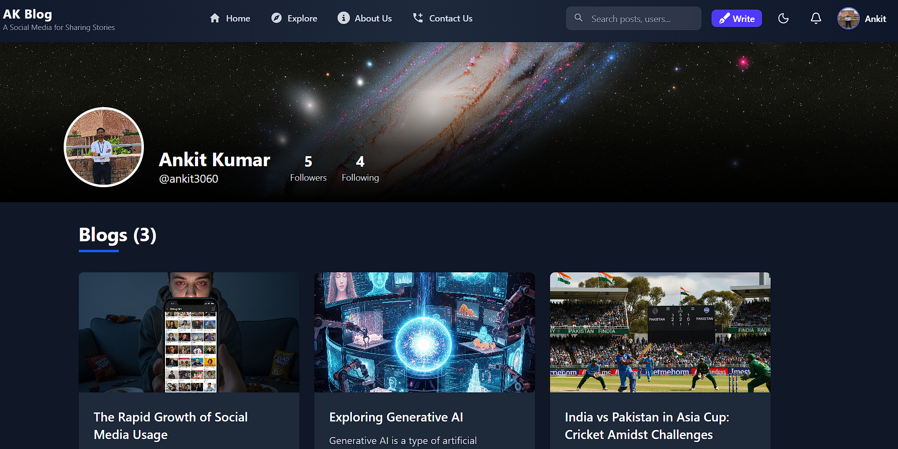
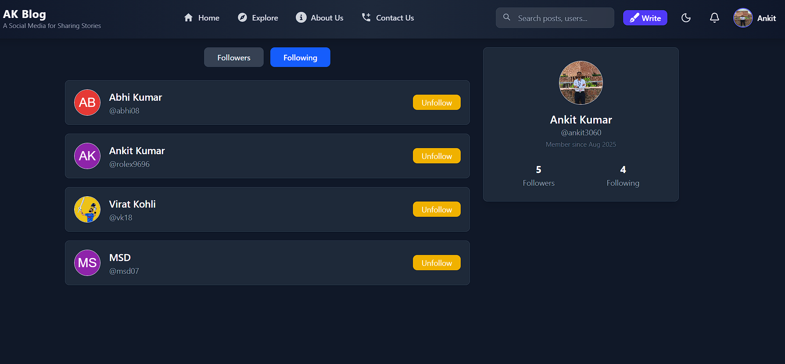
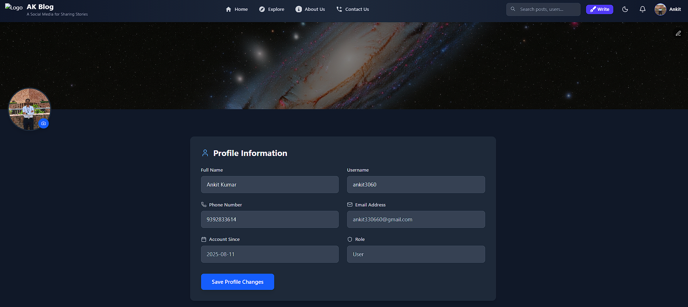
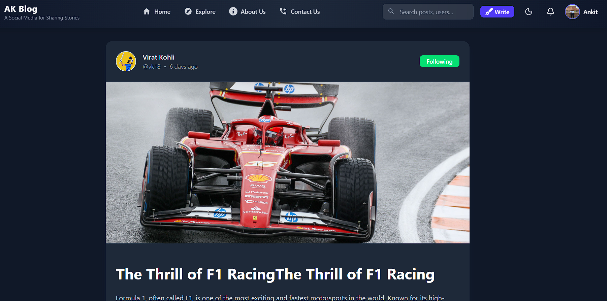
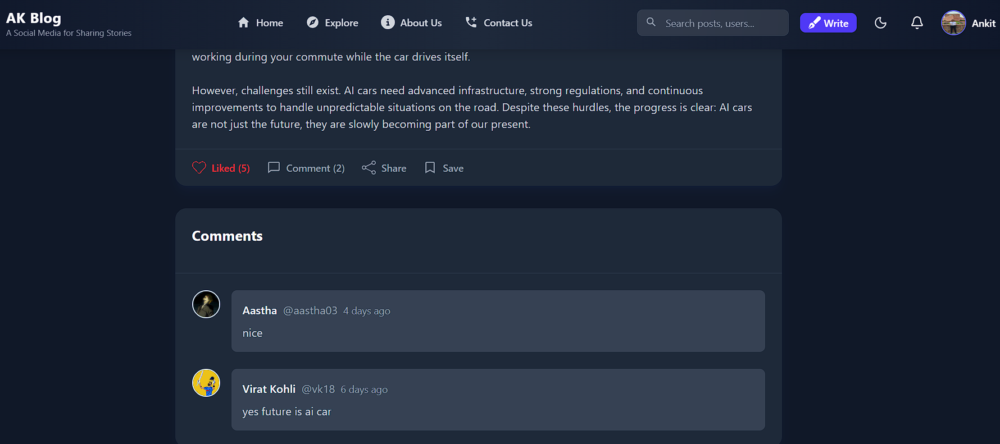


## 🌐 Deployment  

- **Frontend**: [Netlify](https://ak-blogs.netlify.app) 

## ✨ Future Enhancements  
 
- Rich-text editor for blogs  
- Notification system  
- Bookmark blogs  

## 🤝 Contributing  

Contributions are welcome!  
1. Fork the repo  
2. Create a new branch (`feature-new`)  
3. Commit changes  
4. Push & create a Pull Request  
 
